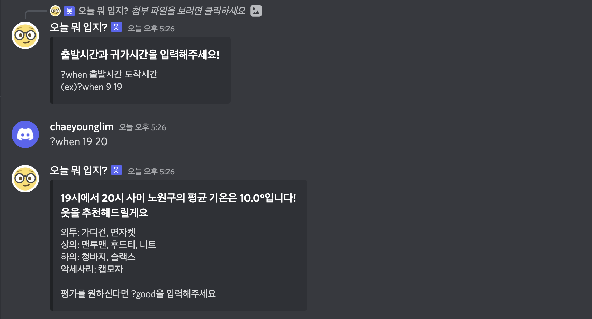

# 👕오늘 뭐 입지?  (Discord Bot)

## ❗️Description
"오늘 뭐 입지?" 디스코드 봇은 사용자가 입력한 외출 장소와 시간 정보를 기반으로 기온을 크롤링하여, 기온 별 옷 레벨 data set을 이용해 외출 시 입을 옷을 추천해줍니다. 

- `?info`를 입력하면 사용자가 더위를 타는 정도를 선택할 수 있습니다. 선택된 정보는 사용자에게 옷을 추천할 때 이용됩니다. 선택 후 사용자는 외출할 장소를 선택해야합니다.
- `?where`를 입력하면 사용자가 외출할 장소를 선택할 수 있습니다. 선택 후 사용자는 외출할 시간을 입력해야합니다.
- `?when`을 입력하면 사용자가 외출할 시간을 입력할 수 있습니다. 만약 귀가 시간이 출발 시간보다 빠르거나 외출 시간을 잘못 입력한 경우 시간을 잘못 입력했다는 메시지를 띄웁니다. 입력 후  외출 장소와 외출 시간을 고려해 옷을 추천해줍니다.
- `?what` 을 입력하면 사용자가 입력한 외출 장소와 외출 시간을 기반으로 저장된 평균 기온을 이용해 외출할 때 입을 옷을 추천해줍니다.
- `?good`을 입력하면 봇이 추천해준 옷에 대한 평가를 할 수 있습니다. 평가한 정보는 기온 별 옷 레벨 data set에 저장되어, 후에 옷을 추천해줄 때 반영됩니다.
## ❗️Running





## ❗️Folder file
- crawling
```
temperature_crawling.py: 사용자가 입력한 외출 장소와 외출 시간을 기반으로 기온 정보를 크롤링하여 출발 시간에서 귀가 시간까지의 기온을 리스트 형태로 return 해줍니다.
```
- discordbot
```
discordbot.py: discord bot을 돌리는 main 파일입니다.
predict.py: 기온 별 옷 레벨 data set을 기반으로 선형 회귀를 이용해 기온에 맞는 옷 레벨을 예측해주는 함수를 담은 파일입니다.
user_data.py: 사용자의 데이터를 구글 스프레드시트에 저장하고 불러오는 함수를 모아놓은 파일입니다.
```
## ❗️Reference
[[#기능신청] 버튼으로 작동하는 디스코드 봇 만들기]([https://www.youtube.com/watch?v=xPAEcn99JxY])
[[Discord.py] 1. 디스코드 봇 개발의 기초]([https://www.jongung.com/199])
[[KR] Python으로 구글 스프레드시트 연동하기 (ft. gspread)]([https://odaily.tistory.com/entry/Python%EC%97%90%EC%84%9C-%EA%B5%AC%EA%B8%80%EC%8A%A4%ED%94%84%EB%A0%88%EB%93%9C%EC%8B%9C%ED%8A%B8-%EB%8D%B0%EC%9D%B4%ED%84%B0-%EA%B0%80%EC%A0%B8%EC%98%A4%EB%8A%94-%EB%B0%A9%EB%B2%95](https://lucaseo.github.io/posts/2020-04-12-python-spreadsheet-gspread/])
[파이썬을 이용한 구글시트 읽고 쓰기 | Google SpreadSheets API | JMON]([https://velog.io/@jmon/%EA%B5%AC%EA%B8%80%EC%8B%9C%ED%8A%B8-API-%EB%A5%BC-%EC%9D%B4%EC%9A%A9%ED%95%9C-%EC%9D%BD%EA%B3%A0-%EC%93%B0%EA%B8%B0-Google-SpreadSheets-API-JMON])


## ❗️Developer

## ❗️License
